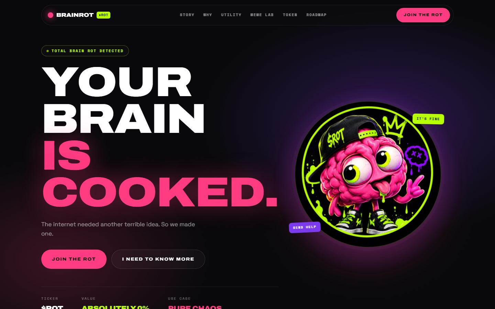

# BRAINROT ($ROT) — landing page



Landing page de una **meme coin ficticia**. HTML + CSS + JS puro, sin frameworks,
sin backend y sin dependencias. Coste de publicación: **0 €**.

> ⚠️ Proyecto meme/experimental. No hay token, ni contrato, ni venta.
> Nada de lo que aparece en la web es asesoramiento financiero y todos los
> números (supply, %, seguidores, chaos meter) son **placeholders ficticios**.

---

## 1. Verla en local

Doble clic en `dev.cmd` y abre <http://localhost:3005>.

O, si prefieres el comando:

```bash
python -m http.server 3005
```

(Si abres `index.html` a pelo funciona todo menos las tipografías: Chrome bloquea
las fuentes locales en `file://`. Con el servidor se ve exactamente como quedará
publicada.)

---

## 2. Publicarla gratis en GitHub Pages

1. Crea un repositorio nuevo en GitHub, por ejemplo `brainrot`.
2. Sube esta carpeta:

```bash
git init
git add .
git commit -m "BRAINROT landing"
git branch -M main
git remote add origin https://github.com/TU-USUARIO/brainrot.git
git push -u origin main
```

3. En GitHub: **Settings → Pages → Source: Deploy from a branch → Branch: `main` / `(root)` → Save**.
4. En 1-2 minutos estará en `https://TU-USUARIO.github.io/brainrot/`.

### Importante: pon tu URL antes de subirlo

Un solo comando lo escribe en todos los sitios (meta tags de Open Graph, canonical,
`config.js`, `sitemap.xml` y `robots.txt`):

```bash
configure.cmd TU-USUARIO
```

Si el repo no se llama `brainrot`, o usas dominio propio:

```bash
configure.cmd TU-USUARIO nombre-del-repo
configure.cmd https://midominio.com/
```

Sin esto la web funciona igual, pero al compartir el enlace en X, Telegram o
Discord no aparecerá la imagen de previsualización.

---

## 3. Editar la web

**Todo el contenido está en un único archivo: `js/config.js`.**

| Qué quieres cambiar | Dónde |
|---|---|
| Nombre, ticker, descripción, URL | `brand` |
| Colores de la paleta | `colors` |
| Imágenes y favicon | `images` |
| Enlaces de X, Telegram, Discord | `social` (pon la URL; con `#` sale como "NOT YET.") |
| Menú y botón del header | `nav` |
| Titular, subtítulo, botones y stats del hero | `hero` |
| Cinta animada | `ticker` |
| Historia, razones, utilidad | `story`, `why`, `utility` |
| Chaos meter y sus mensajes | `chaos` |
| Respuestas del oráculo | `oracle.answers` |
| Tarjetas de memes | `memeLab.cards` |
| Comunidad y números demo | `community` |
| Tokenomics (**porcentajes placeholder**) | `token` |
| Roadmap | `roadmap` |
| Niveles "How cooked are you?" | `levels` |
| Preguntas frecuentes | `faq` |
| Pie y disclaimer legal | `footer` |

Cambiando solo ese archivo (y las imágenes) tienes otra landing distinta con la misma base.

### Mascota en SVG

Las caras del cerebro del **Meme Lab** son SVG originales incrustados en `index.html`
(bloque `<svg class="sprite">`). Expresiones disponibles:

`rot-normal`, `rot-happy`, `rot-confused`, `rot-sleepy`, `rot-hyper`,
`rot-cooked`, `rot-melting`, `rot-dead`, `rot-surprised`, `rot-victory`

En `memeLab.cards` se elige con `mascot: 'cooked'`, `mascot: 'sleepy'`, etc.

### Chaos meter con datos reales (opcional)

Está preparado para conectarse a una API en el futuro:

```js
chaos: { endpoint: 'https://tu-api.com/chaos' }   // debe devolver { "value": 87 }
```

Si `endpoint` es `null` la barra usa el valor local (simulado).

---

## 4. Estructura

```
/
  index.html          marcado + sprite SVG de la mascota + meta/SEO
  dev.cmd             servidor local (puerto 3005)
  configure.cmd       escribe tu URL pública en todos los archivos
  configure.mjs       lógica del configurador (Node, sin dependencias)
  robots.txt          indexable + referencia al sitemap
  sitemap.xml         una sola URL
  .nojekyll           evita que GitHub Pages procese la carpeta con Jekyll
  README.md
/css
  styles.css          diseño completo (paleta, layout, animaciones, responsive)
/js
  config.js           ← TODO el contenido editable
  app.js              renderiza las secciones y las interacciones
/assets/images        mascota, moneda, imagen social (OG 1200x630) y preview
/assets/icons         favicon 32px y apple-touch-icon 180px
/assets/fonts         tipografías autoalojadas (.woff2) + licencia OFL
```

---

## 5. Detalles técnicos

- **Cero peticiones a terceros.** Las tipografías (Archivo, Space Grotesk, Space Mono,
  todas con licencia OFL) están autoalojadas en `assets/fonts/`, así que la web
  funciona entera sin conexión y no filtra visitas a ningún servidor externo.
- **Ligera:** 12 peticiones y ~560 KB en la primera carga (142 KB de fuentes,
  332 KB de imágenes, 70 KB de código), todo cacheable.
- **Rápida:** imágenes optimizadas, `loading="lazy"` fuera del hero, JS mínimo
  y sin frameworks. Primer pintado por debajo del segundo en local.
- **Accesible:** foco visible, `prefers-reduced-motion` respetado, textos
  alternativos y áreas táctiles de 44 px o más.
- **Responsive:** verificada en 1440, 768, 430, 390 y 375 px.
- **SEO:** title, description, Open Graph, Twitter card, favicon, imagen social,
  `robots.txt` y `sitemap.xml`.

---

## 6. Licencia y avisos

- La mascota y la moneda son assets propios del proyecto; no se usan marcas de terceros.
- Las tipografías son de Google Fonts bajo SIL Open Font License 1.1; el texto de
  la licencia va incluido en `assets/fonts/OFL.txt`.
- La web no representa a ninguna persona real.
- Antes de usar esto para algo serio, sustituye los datos placeholder y revisa la
  normativa de tu país sobre promoción de criptoactivos.
